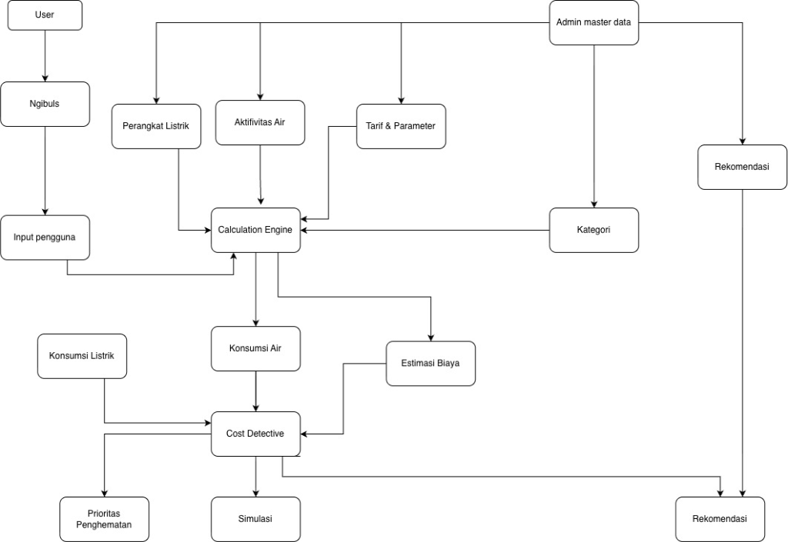
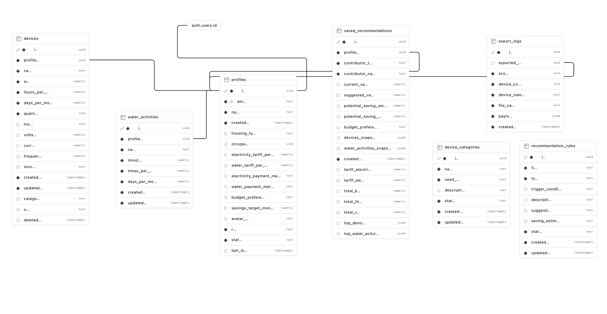

<div align="center">
  
  # Ngibuls 
  ### Platform Cerdas Analisis & Simulasi Penghematan Energi Listrik
  
  [](https://ngibuls.vercel.app/)
  [](https://github.com/Andriangaming1945/Ngibuls)
  [](LICENSE)
  
  **Submission for ITECHNO CUP 2026 - Web Development**
  
  **By Salah Pencet**
  
</div>

---

## 📋 Daftar Isi

- [Tentang Proyek](#-tentang-proyek)
- [Fitur Unggulan](#-fitur-unggulan)
- [Demo & Screenshot](#-demo--screenshot)
- [Teknologi](#-teknologi)
- [Arsitektur Sistem](#-arsitektur-sistem)
- [Instalasi & Setup](#-instalasi--setup)
- [Penggunaan](#-penggunaan)
- [Testing](#-testing)
- [Tim Developer](#-tim-developer)
- [Lisensi](#-lisensi)

---

## 👥 Tim Developer

| Nama | Peran | Kontak |
|------|-------|--------|
| **Andrian Dwiputra Wibowo** | Project Lead & Full Stack Developer | [anrianwibowo06@gmail.com](mailto:anrianwibowo06@gmail.com) |
| **Fa-Iz Faadhillah Ibrahim** | Full Stack Developer | [faiz.faadhillah@gmail.com](mailto:faiz.faadhillah@gmail.com) |

---

## 🎯 Tentang Proyek

### Latar Belakang

Banyak pengguna rumah tangga yang mengalami tagihan listrik membengkak setiap bulan tanpa menyadari perangkat elektronik mana yang menjadi penyumbang terbesar. Kurangnya pemahaman tentang manajemen penggunaan listrik harian, sulitnya menghitung estimasi biaya berdasarkan daya (Watt) dan waktu pakai, membuat langkah efisiensi dan penghematan menjadi sangat sulit dilakukan oleh masyarakat awam.

### Solusi yang Ditawarkan

Ngibuls (Hemat Listrik) hadir sebagai solusi interaktif yang menjembatani masalah tersebut. Aplikasi ini mensimulasikan penggunaan listrik harian pengguna dengan mengumpulkan data perangkat elektronik dan kebiasaan (habit) pengguna. Dengan analisis cerdas, sistem secara otomatis menghitung estimasi pengeluaran, mendeteksi sumber pemborosan, dan memberikan rekomendasi penghematan energi secara praktis dan personal.

### Tujuan Proyek

- 🎯 **Tujuan Utama**: Membantu pengguna memonitor, menganalisis, dan mengurangi konsumsi listrik berlebih secara efektif.
- 📊 **Target Pengguna**: Rumah tangga, mahasiswa/anak kos, serta individu yang ingin mengelola pengeluaran listrik bulanan mereka.
- 💡 **Value Proposition**: Pendekatan simulasi real-time yang user-friendly, dipadukan dengan rekomendasi personal dan kemudahan akses berbasis web.

---

## ✨ Fitur Unggulan

### Fitur Utama

| Fitur | Deskripsi | Keunggulan |
|----------|--------------|---------------|
| **Kalkulator & Simulasi** | Menghitung estimasi biaya listrik berdasarkan perangkat dan lama penggunaan. | Memberikan gambaran pengeluaran secara real-time dan transparan. |
| **Input Kebiasaan (Habit)** | Pengguna dapat memasukkan pola kebiasaan harian pemakaian alat elektronik. | Menghasilkan analisis spesifik yang disesuaikan dengan aktivitas nyata pengguna. |
| **Rekomendasi Cerdas** | Sistem memberikan saran langkah-langkah penghematan energi. | Rekomendasi tepat sasaran untuk memotong biaya tanpa mengorbankan produktivitas. |
| **OCR Scanner** | Ekstraksi teks dari gambar (misal: spesifikasi daya pada alat). | Memudahkan pengguna yang tidak tahu cara membaca label daya (Watt) secara manual. |

### Fitur Tambahan

- **Manajemen Profil & Riwayat** - Melacak riwayat simulasi dan rekomendasi penghematan (History Tracking).
- **Export Laporan** - Unduh hasil analisis penggunaan listrik dalam format PDF atau Excel.
- **Admin Dashboard** - Panel kontrol komprehensif untuk manajemen pengguna dan pemantauan data.
- **Smooth Animations** - Antarmuka interaktif dan mulus menggunakan library animasi dan transisi yang responsif.

---

## 📸 Demo & Screenshot

### Live Demo

🔗 **[Kunjungi Website Ngibuls](https://ngibuls.vercel.app/)**

---

## 🛠️ Teknologi

### Tech Stack

#### Frontend
```text
Framework    : Vue 3
Build Tool   : Vite
UI Library   : Tailwind CSS v4, Lucide Vue
Animations   : Anime.js
Utilities    : Tesseract.js (OCR), jsPDF, ExcelJS
```

#### Backend & Database
```text
BaaS         : Supabase
Database     : PostgreSQL (via Supabase)
Auth         : Supabase Auth
```

#### DevOps & Tools
```text
Deployment   : Vercel
Version Ctrl : Git & GitHub
```

### Alasan Pemilihan Teknologi

| Teknologi | Alasan Pemilihan |
|-----------|------------------|
| **Vue 3 & Vite** | Menawarkan performa rendering yang sangat cepat berkat Composition API, dipadukan dengan Vite yang membuat waktu build dan HMR (Hot Module Replacement) instan. |
| **Supabase** | Memberikan solusi backend-as-a-service yang lengkap (Auth, Database PostgreSQL, API) yang mudah diintegrasikan, sangat cocok untuk pengembangan cepat. |
| **Tailwind CSS** | Mempercepat proses styling (utility-first) secara terstruktur tanpa perlu berpindah konteks ke file CSS eksternal, membuat UI seragam dan responsif. |

---

## 🏗️ Arsitektur Sistem

### System Architecture



### Database Schema (ERD)



*Detail struktur tabel dan constraint SQL dapat dilihat pada file [`docs/schema.sql`](./docs/schema.sql)*

### Folder Structure

```text
ngibuls/
├── public/                 # Static assets
├── src/                    
│   ├── assets/             # CSS & Images
│   ├── components/         # Reusable UI components
│   │   ├── admin/          # Admin specific components
│   │   ├── profile/        # User profile components
│   │   └── user/           # End-user interactive components
│   ├── composables/        # Vue 3 custom hooks/logic (auth, calcs)
│   ├── lib/                # Config files (e.g. supabase.js)
│   ├── router/             # Vue Router configurations
│   ├── view/               # Page components / Views
│   ├── App.vue             # Root component
│   └── main.js             # Application entry point
├── package.json            # Dependencies list
└── vite.config.js          # Vite configurations
```

---

## ⚙️ Instalasi & Setup

### Prerequisites

Pastikan Anda telah menginstall:
- **Node.js** (v22.18.0 atau lebih tinggi, disarankan v24+)
- **npm** (atau package manager lain)
- **Git**

### Langkah Instalasi

#### 1️⃣ Clone Repository

```bash
git clone https://github.com/Andriangaming1945/Ngibuls.git
cd Ngibuls
```

#### 2️⃣ Install Dependencies

```bash
npm install
```

#### 3️⃣ Setup Environment Variables

Buat file `.env` di root directory dan isi dengan kredensial Supabase Anda:

```env
VITE_SUPABASE_URL="https://[YOUR_SUPABASE_PROJECT].supabase.co"
VITE_SUPABASE_ANON_KEY="[YOUR_SUPABASE_ANON_KEY]"
```

#### 4️⃣ Run Development Server

```bash
npm run dev
```

Aplikasi akan berjalan secara lokal. Buka tautan `http://localhost:5173` (default Vite) di browser Anda.

---

## 🚀 Penggunaan

### Menjalankan Aplikasi

```bash
# Development mode (Hot-reload)
npm run dev

# Membangun versi production
npm run build

# Preview hasil build production
npm run preview
```

### User Guide

#### Untuk Pengguna Umum

1. **Registrasi/Login**: Buka aplikasi dan buat akun melalui menu Sign Up atau masuk menggunakan akun yang ada.
2. **Kalkulasi & Simulasi**: Masuk ke halaman Simulasi, masukkan jenis perangkat elektronik beserta jumlah Watt dan durasi pemakaian (Jam/Hari).
3. **Analisis**: Klik "Hitung" untuk melihat hasil analisis lengkap pengeluaran dan rekomendasi tips hemat energi.
4. **Export Laporan**: Di akhir halaman hasil, pilih opsi download sebagai PDF atau Excel untuk menyimpan riwayat.

#### Untuk Admin

1. **Akses Admin Panel**: Login dengan kredensial berlevel admin.
2. **Manajemen Pengguna**: Akses menu dashboard untuk melihat dan mengelola data registrasi pengguna secara keseluruhan.

---

## 📄 Lisensi

Proyek ini dibuat dengan lisensi MIT.

---

<div align="center">

  **Made with ❤️ by Salah Pencet for ITECHNO CUP 2026**

</div>
